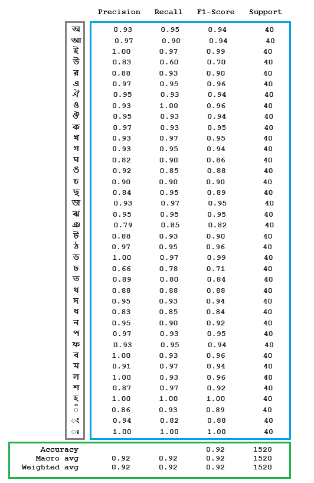

# Bangla Sign Language Recognition Using Concatenated BdSL Network
This repository contains the Tensorflow implementation of our model "Bangla Sign Language Recognition Using Concatenated BdSL Network" <br>
[[Code](https://github.com/orvee-17/concatenated_bdsl)] [[Paper](https://arxiv.org/ftp/arxiv/papers/2107/2107.11818.pdf)] [[ArXiv](https://arxiv.org/abs/)]


## Authors
   [Thasin Abedin](https://github.com/orvee-17), [Khondokar S. S. Prottoy](https://github.com/KhondokarProttoy), [Ayana Moshruba](), [Safayet Bin Hakim]()

## Requirements
Install the following dependencies before running the model
  - Tensorflow 2.2 `pip install tensorflow == 2.2`
  - sklearn `pip install -U scikit-learn`
  - Pandas `pip install pandas`
  - Numpy `pip install numpy`
  - Keras `pip install keras`
  - Pillow `pip install Pillow`
  - OpenCV `pip3 install opencv-python`

## Directory structure
```
-root
  -image_only_network.ipynb
  -main.ipynb
  -numpy_conversion.ipynb
  -pretrained_openpose.ipynb
  -bangla_dataset
    -np_files
      -imglist_t.npy
      -imglist_v.npy
      -labellist_t.npy
      -labellist_v.npy
      -poselist_t.npy
      -poselist_v.npy      
    -train
    -test
    -validate
  -hand_models
    -pose_deploy.prototxt
    -pose_iter_102000.caffemodel (Download this pretrained file)
```

## Train and Evaluate
  - Download and extract 'pose_deploy.prototxt' and 'pose_iter_102000.caffemodel' and put them in 'hands_model' folder.
  - Download the [MSVD](https://www.microsoft.com/en-us/download/details.aspx?id=52422&from=https%3A%2F%2Fresearch.microsoft.com%2Fen-us%2Fdownloads%2F38cf15fd-b8df-477e-a4e4-a4680caa75af%2F) dataset. Split the data in train-test-val sets.
  - Run the numpy_conversion.ipynb file first. This makes the numpy files for images, labels and pose estimations for train, test and validation sets and saves them in 'np_files' folder.
  - After that run the main.ipynb file to train the 'Concatenated BdSL Network' and save the weights in 'file_weights' folder. The validation and test results can also be obtained by running this.

## Results
<br>

<br>

<br>

<br>
